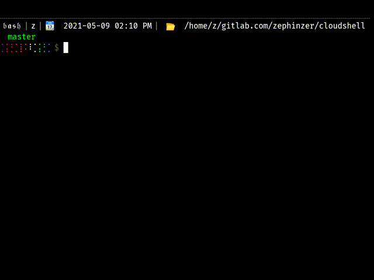

# Cloudshell

This project contains an Xterm.js frontend that connets to a Go backend to provide a shell to the host system. Basically, access your shell from a browser.

Some use cases I had:

1. Deploy to a compute instance in your networks and expose it when needed to gain shell access to your network over the browser
2. Deploy to a Kubernetes cluster with appropriate (Cluster)Role and (Cluster)RoleBinding resources to allow some level of access to developers
3. Exposing a CLI tool (see [`./examples/k9s`](./examples/k9s) for an example) over the browser. Think CLI-as-a-frontend
4. Doing a demo for a CLI tool over the browser

**Table of Contents**

- [Cloudshell](#cloudshell)
- [Development](#development)
  - [Install dependencies](#install-dependencies)
  - [Test run it](#test-run-it)
- [Build/Release](#buildrelease)
  - [Building the project](#building-the-project)
  - [Creating the Docker image](#creating-the-docker-image)
  - [Publishing the Docker image](#publishing-the-docker-image)
  - [Publishing example Docker images](#publishing-example-docker-images)
- [Usage/Configuration](#usageconfiguration)
  - [Cloudshell CLI tool](#cloudshell-cli-tool)
- [Deploy](#deploy)
  - [Running the Docker image](#running-the-docker-image)
  - [Deploying via Helm](#deploying-via-helm)
- [CI/CD](#cicd)
- [License](#license)

# Development

## Install dependencies

Run `make init` to install both Node.js and Golang dependencies.

## Test run it

Run `make start` to start the Go backend which will also serve the static files for the website.

Open your browser at http://localhost:8376 to view your shell in the browser.

# Build/Release

## Building the project

To build this project, run `make build` to build the binary

## Creating the Docker image

Run `make package` to create the Docker image. To customise the package process:

1. Create a file named `Makefile.properties` (this will be `-include`d by the Makefile)
2. Set `image_namespace` to your desired namespace (defaults to `zephinzer`)
3. Set `image_name` to your desired image name (defaults to `cloudshell`)
4. Set `image_tag` to your desired tag (defaults to the first 8 characters of the Git commit hash)

## Publishing the Docker image

Run `make publish` to publish the Docker image. Same customisations as above apply.

## Publishing example Docker images

Run `make publish-example id=${id}` to publish the example Docker images where `${id}` is the directory name of the directory in the [`./examples` directory](./examples).

# Usage/Configuration

## Cloudshell CLI tool

Configurations can be set via flags or environment variables. To view available configurations in your binary instance, run `cloudshell --help`. Otherwise, flags and environment variables follow a rule of `kebab-lower-case` for flags and `SNAKE_UPPER_CASE` for environment variables.

| Configuration | Flag | Environment Variable | Default Value | Description |
| --- | --- | --- | --- | --- |
| Allowed hostnames | `--allowed-hostnames` | `ALLOWED_HOSTNAMES` | `"localhost"` | Comma delimited list of hostnames that are allowed to connect to the websocket |
| Arguments | `--arguments` | `ARGUMENTS` | `"-l"` | Comma delimited list of arguments that should be passed to the target binary |
| Command | `--command` | `COMMAND` | `"/bin/bash"` | Absolute path to the binary to run |
| Connection error limit | `--connection-error-limit` | `CONNECTION_ERROR_LIMIT` | `10` | Number of times a connection should be re-attempted by the server to the XTerm.js frontend before the connection is considered dead and shut down |
| Keepalive ping timeout | `--keepalive-ping-timeout` | `KEEPALIVE_PING_TIMEOUT` | `20` | Maximum duration in seconds between a ping and pong message to tolerate |
| Maximum buffer size in bytes | `--max-buffer-size-bytes` | `MAX_BUFFER_SIZE_BYTES` | `512` | Maximum length of input from the browser terminal |
| Log format | `--log-format` | `LOG_FORMAT` | `"text"` | Format with which to output logs, one of `"json"` or `"text"` |
| Log level | `--log-level` | `LOG_LEVEL` | `"debug"` | Minimum level of logs to output, one of `"trace"`, `"debug"`, `"info"`, `"warn"`, `"error"` |
| Liveness probe path | `--path-liveness` | `PATH_LIVENESS` | `"/healthz"` | Path to liveness probe handler endpoint |
| Metrics probe path | `--path-metrics` | `PATH_METRICS` | `"/metrics"` | Path to metrics endpoint |
| Readiness probe path | `--path-readiness` | `PATH_READINESS` | `"/readiness"` | Path to readiness probe handler endpoint |
| Xterm.js path | `--path-xtermjs` | `PATH_XTERMJS` | `"/xterm.js"` | Path to xterm.js websocket endpoint |
| Server address | `--server-address` | `SERVER_ADDRESS` | `"0.0.0.0"` | IP interface the server should listen on |
| Server port | `--server-port` | `SERVER_PORT` | `8376` | Port the server should listen on |
| Working directory | `--workdir` | `WORKDIR` | `"."` | Path to the working directory that Cloudshell should use |

# Deploy

## Running the Docker image

Run `make run` to run the Docker image locally

## Deploying via Helm

Go to [`./deploy/cloudshell`](./deploy/cloudshell) and run `helm install --values ./values.yaml --set-url url=cloudshell.yourdomainname.com cloudshell .`. Replace `cloudshell.yourdomainname.com` with your own domain name. You could also set the `url` property inside the `./values.yaml` file.

# CI/CD

The following environment variables should be set in the CI pipeline:

| Key | Example | Description |
| --- | --- | --- |
| `DOCKER_REGISTRY_URL` | `"docker.io"` | URL of the Docker registry to push the image to |
| `DOCKER_REGISTRY_USER` | `"zephinzer"` | User to identify with for the registry at `DOCKER_REGISTRY_URL` |
| `DOCKER_REGISTRY_PASSWORD` | `"p@ssw0rd"` | Password for the user identified in `DOCKER_REGISTRY_USER` for the registry at `DOCKER_REGISTRY_URL` |

# License

This project is licensed under the MIT license.
